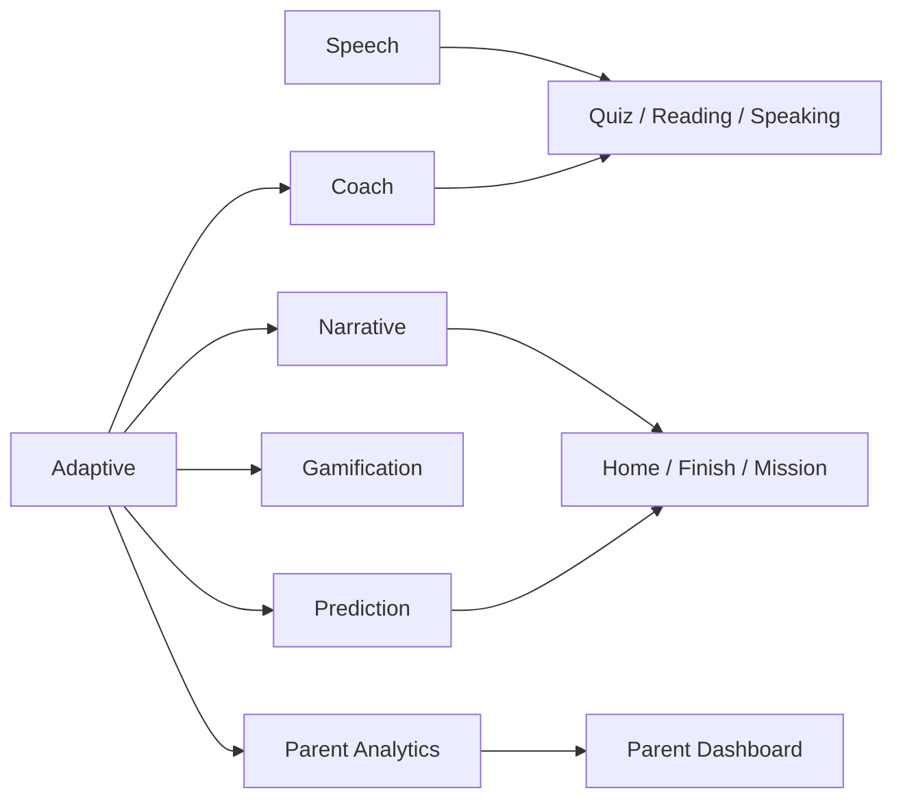

# AI Engine Documentation

## Overview

Jannati AI Tutor uses layered AI engines to turn learning data into subject guidance, next-step recommendations, narrative feedback, and dashboard insights.

## Adaptive Learning

Adaptive learning tracks progress, mastery, accuracy, streaks, and revision needs. It powers lesson selection, practice focus, and readiness-related outputs.

## Question Engine

The question engine selects and shapes questions while trying to preserve answer accuracy, topic coverage, difficulty balance, and repeat prevention.

## AI Explain

AI Explain turns a learner response into a teacher-style explanation:

- explains why an answer is correct or incorrect
- gives short, topic-relevant hints
- provides examples and common mistakes

## AI Teacher

AI Teacher is the guided teaching companion. It helps with concept explanation, practice guidance, and topic-specific advice.

## Speech Engine

The speech layer supports:

- voice reading of questions and feedback
- browser speech recognition for supported flows
- cleanup for retry, unmount, and route-change paths

## Reading Coach

Reading flows focus on transcript capture, safe result handling, and stable fallback messages when the browser does not return speech data.

## Listening

Listening flows support spoken-response capture and must safely handle:

- empty transcript results
- Safari timing differences
- permission denial
- timeout cleanup

## Speaking

Speaking flows use browser speech synthesis where available and must not overlap with active recognition.

## Writing

Writing flows preserve answer evaluation, prompt handling, and safe resume behavior without changing scoring logic.

## Resume

Resume logic restores:

- the current subject
- the active topic
- the current question index
- answer state

Malformed resume data should fall back safely to a valid session.

## Analytics

Analytics engines turn learning history into:

- weekly summaries
- subject comparison
- readiness indicators
- improvement signals
- timeline entries

## Parent Dashboard

The parent dashboard uses analytics engines to show:

- weekly trend
- subject comparison
- study habit
- recommendation
- timeline

## Engine Relationship Diagram

