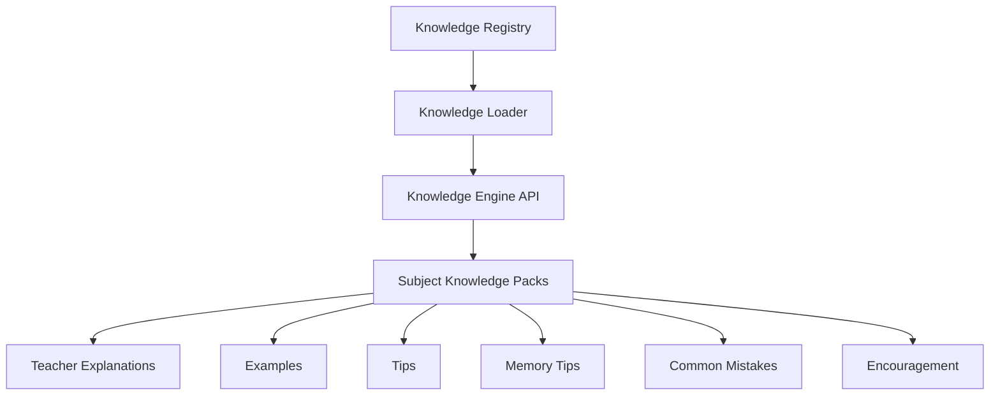

# AI Coach Knowledge Engine

## Purpose

The Coach Knowledge Engine is a new subject-aware foundation for teacher explanations, examples, tips, memory tips, common mistakes, encouragement, and adaptive advice.

This phase creates the architecture only. It does not replace the current coach logic yet and does not migrate existing content.

## Architecture



## Folder Layout

```text
src/ai/coach/knowledge/
  engine/
  loader/
  registry/
  subjects/
  schemas/
```

## Knowledge Schema

Each knowledge pack follows a shared structure:

```json
{
  "subjectId": "bm",
  "topicId": "kata_nama",
  "explanations": [],
  "examples": [],
  "memoryTips": [],
  "tips": [],
  "commonMistakes": [],
  "encouragement": {
    "correct": [],
    "retry": [],
    "excellent": []
  }
}
```

## Registry

The registry maps subject IDs to topic knowledge packs.

| Subject | Sample topic |
|---|---|
| bm | kata_nama |
| english | nouns |
| math | money |
| sains | animals |
| arab | huruf |
| islam | akhlak |
| pj | movement |
| pk | hygiene |

## Loader

The loader provides a stable API:

```js
loadKnowledge(subjectId, topicId)
```

It returns normalized arrays for:

- explanations
- examples
- memory tips
- tips
- common mistakes
- encouragement blocks

If a pack is missing, the loader returns a safe empty pack instead of throwing.

## Future Migration Strategy

The intended migration path is:

1. Keep current coach logic in place.
2. Migrate one subject at a time into the knowledge engine.
3. Route coach surfaces through the new loader after coverage is ready.
4. Add validation and quality checks per subject and per topic.
5. Gradually retire hardcoded shared fallback text only after the knowledge packs are complete.

## Design Goals

- Subject-aware rather than BM-centric
- Topic-specific teacher guidance
- Safe fallback behavior
- Easy incremental migration
- No impact on scoring, speech, or adaptive logic during foundation phase

