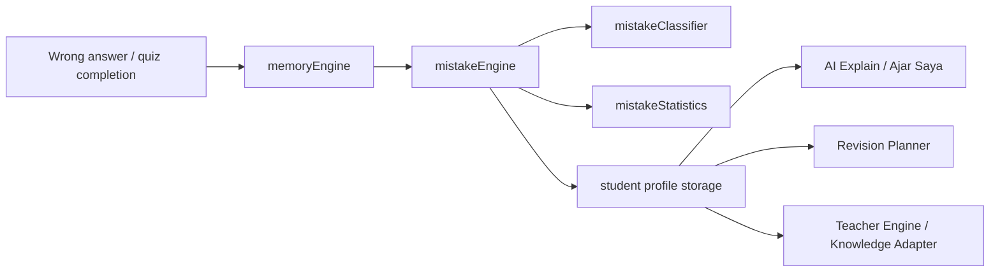

# AI Mistake Intelligence Engine Report

Branch: `feature/mistake-intelligence-engine`

## Overview

This sprint adds a rule-based mistake intelligence layer so Jannati AI Tutor can understand why a wrong answer happened, not just whether it was wrong.

The engine is designed to stay lightweight, deterministic, and safe to use alongside the existing tutor, profile, and revision systems.

## Architecture

### Files added

- `src/ai/mistakes/mistakeEngine.js`
- `src/ai/mistakes/mistakeClassifier.js`
- `src/ai/mistakes/mistakePatterns.js`
- `src/ai/mistakes/mistakeStatistics.js`
- `src/ai/mistakes/index.js`

### Existing files extended

- `src/ai/profile/studentProfile.js`
- `src/ai/profile/progressAnalyzer.js`
- `src/ai/profile/revisionPlanner.js`
- `src/ai/memoryEngine.js`
- `src/ai/coach/knowledge/knowledgeAdapter.js`
- `src/ai/explainEngine.js`
- `src/ai/teacherEngine.js`
- `src/ai/revision/revisionPlannerEngine.js`

## Classification Model

The classifier is rule-based and deterministic.

It uses:

- subject id
- topic id
- question text
- hints and explanations
- learner answer vs correct answer
- subject-specific keyword patterns

If a pattern cannot be matched, the engine returns `UNKNOWN_MISTAKE` and the app keeps the existing behaviour.

### General mistake model

Each mistake record includes:

- `mistakeId`
- `mistakeType`
- `confidence`
- `subject`
- `topic`
- `subTopic`
- `detectedPattern`
- `teacherSuggestion`
- `recommendedPractice`
- `difficultyLevel`
- `timestamp`

## Supported Mistake Categories

### Mathematics

- Borrowing mistake
- Carrying mistake
- Digit alignment
- Place value confusion
- Multiplication table recall
- Division misunderstanding
- Operation confusion
- Money calculation mistake
- Time calculation mistake
- Measurement conversion mistake

### Bahasa Melayu

- Wrong penjodoh bilangan
- Wrong kata kerja
- Wrong kata nama
- Wrong kata adjektif
- Wrong kata hubung
- Wrong kata sendi
- Sentence structure issue
- Grammar issue
- Reading comprehension issue

### English

- Subject-verb agreement
- Plural confusion
- Verb tense confusion
- Preposition mistake
- Article mistake
- Vocabulary confusion
- Reading comprehension issue

### Science

- Concept misconception
- Observation mistake
- Classification mistake
- Living/non-living confusion
- Body parts misunderstanding
- Plant misconception
- Matter misconception
- Light/Sound misconception

### Arabic

- Vocabulary confusion
- Letter confusion
- Pronunciation confusion
- Reading mistake
- Writing mistake
- Gender confusion
- Number confusion

### Pendidikan Islam

- Jawi reading issue
- Hafazan recall issue
- Ibadah sequence issue
- Akhlak misconception
- Sirah confusion

### PJ / PK

- Safety misconception
- Health misconception
- Body movement misunderstanding
- Nutrition misunderstanding

## Profile Integration

The learning profile now stores:

- top mistakes
- most repeated mistakes
- recent mistakes
- mistake frequency
- mistake improvement trend

The profile also keeps subject and topic level mistake counters so weak areas are easier to identify later.

## Coach Integration

Mistake context is now available to:

- AI Explain
- Ajar Saya
- Teacher Engine
- Knowledge Adapter

This allows the tutor to:

- explain repeated mistakes more carefully
- focus on the correct rule or strategy
- avoid over-explaining mastered concepts

## Revision Integration

The revision planner now gives extra priority to topics that are both weak and repeatedly mistaken.

This makes revision more focused and more useful for the learner.

## Statistics

The statistics layer produces:

- top 10 mistakes
- weekly mistakes
- monthly mistakes
- repeated mistake count
- improvement percentage

These reports are derived from stored mistake records and remain deterministic.

## Safe Fallback

If the engine cannot determine a pattern, it returns:

- `UNKNOWN_MISTAKE`

The existing tutor flow continues normally.

## Future AI Opportunities

- better operation-specific math diagnosis
- deeper grammar classification for BM and English
- per-topic mistake trend graphs
- parent-facing mistake summaries
- adaptive retry hints based on repeated mistake patterns

## Validation

Passed:

- `node scripts/validate/questionValidator.js`
- `node scripts/validate/speechRegression.mjs`
- `npm run build`

## Risk Assessment

- Runtime risk is low because the engine is rule-based and stored behind safe profile helpers.
- Coaching risk is low because the engine augments fallback guidance rather than replacing it.
- Maintenance risk is moderate: future accuracy gains will come from expanding the rule set and refining pattern coverage.

