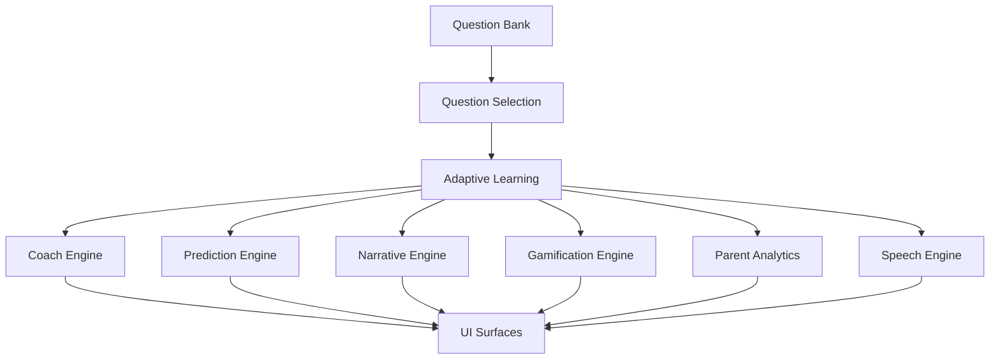

# Project Architecture

## Folder Structure

```text
src/
  ai/
    adaptive/
    coach/
    diversity/
    gamification/
    memory/
    narrative/
    observation/
    parentAnalytics/
    personality/
    prediction/
    question/
    questionGenerator/
    revision/
    speech/
    voice/
  components/
  dashboard/
  data/
  styles/
  utils/
```

## Architecture Overview

| Layer | Responsibility |
|---|---|
| Question Bank | Stores Year 2 subject content, answers, hints, explanations, and metadata |
| AI Engines | Build adaptive, coach, narrative, prediction, memory, and gamification outputs |
| Speech Engine | Handles voice and speech-recognition flows in the browser |
| Dashboard | Presents student, parent, analytics, and revision views |
| Validation | Audits question quality, curriculum coverage, speech behavior, and style |
| Build | Produces production bundles with Vite |

## System Flow



## Key Responsibilities

- `src/ai/adaptive/` owns learning-state calculations, mastery, revision, and recommendation logic.
- `src/ai/coach/` owns hint, explanation, encouragement, and teaching-style decisions.
- `src/ai/narrative/` owns human-friendly teacher-style messages.
- `src/ai/personality/` owns Janna and Jati conversational tone.
- `src/ai/prediction/` provides readiness and study-plan outputs.
- `src/ai/speech/` and `src/ai/voice/` provide browser speech input/output.
- `src/dashboard/` composes the dashboards and shared metric cards.

## Validation and Release Flow

1. Content and curriculum validation scripts are run.
2. Speech and UI regressions are checked.
3. Production build is generated with Vite.
4. Release candidate documentation is reviewed.
5. Final RC tag is prepared only after sign-off.

