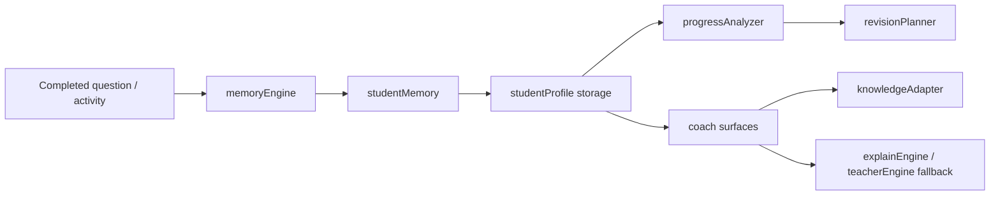

# Smart Personal Tutor Report

Branch: `feature/smart-personal-tutor`

## Overview

This sprint adds a lightweight intelligence layer that turns the tutor into a more personal learning companion.

The new profile system tracks learning history, confidence, weak topics, strong topics, and revision priorities without changing the UI or the question engine.

## Architecture

| Layer | Responsibility |
| --- | --- |
| `src/ai/profile/studentProfile.js` | Loads, saves, and migrates the student learning profile. |
| `src/ai/profile/studentMemory.js` | Applies question completions and study activity updates to the profile. |
| `src/ai/profile/confidenceEngine.js` | Calculates confidence deltas and topic status. |
| `src/ai/profile/progressAnalyzer.js` | Produces weak-topic and strong-topic rankings plus learning summaries. |
| `src/ai/profile/revisionPlanner.js` | Generates a simple daily revision plan from the weakest topics. |
| `src/ai/memoryEngine.js` | Syncs completed quiz/activity events into the profile automatically. |
| `src/ai/coach/knowledge/knowledgeAdapter.js` | Adds profile-aware coaching context to AI Explain / Ajar Saya surfaces. |
| `src/ai/explainEngine.js` / `src/ai/teacherEngine.js` | Improve fallback coaching with the same profile-aware logic. |

### Flow



## Student Profile Schema

```js
{
  version,
  studentId,
  name,
  year,
  avatar,
  isDemo,
  createdAt,
  updatedAt,
  totals: {
    questionsAnswered,
    correct,
    wrong,
    accuracy,
    currentStreak,
    longestStreak,
    totalStudySeconds,
    averageResponseTimeMs,
    totalResponseTimeMs,
    lastAnsweredAt,
    lastStudyDate,
    activitiesCompleted
  },
  subjects: {
    [subjectId]: {
      subjectId,
      title,
      short,
      attempts,
      correct,
      wrong,
      accuracy,
      averageResponseTimeMs,
      totalResponseTimeMs,
      strongestTopic,
      weakestTopic,
      lastPractised,
      topicCount,
      topics: {
        [topicId]: {
          subjectId,
          topicId,
          title,
          attempts,
          correct,
          wrong,
          accuracy,
          confidence,
          status,
          statusLabel,
          lastPractised,
          lastAttemptAt,
          averageResponseTimeMs,
          totalResponseTimeMs,
          firstTryCorrect,
          repeatedWrong
        }
      }
    }
  },
  topics: {
    [subjectId]: {
      [topicId]: { ...same topic record... }
    }
  }
}
```

## Confidence Algorithm

| Outcome | Delta |
| --- | ---: |
| Correct, first try | +3 |
| Correct, later try | +2 |
| Wrong, first mistake | -3 |
| Wrong, repeated mistake | -5 |

Confidence is clamped between `0` and `100`.

Topic status mapping:

| Confidence | Status |
| --- | --- |
| 90–100 | Mastered |
| 70–89 | Good |
| 40–69 | Needs Practice |
| 0–39 | Weak |

## Weak-Topic Detection

Weak topics are ranked by:

1. Lowest confidence
2. Lowest accuracy
3. Lowest attempt count
4. Stable subject/topic id ordering

The profile helpers expose:

- `getWeakTopics(studentId)`
- `getStrongTopics(studentId)`
- `getTopicProgress(studentId, subjectId, topicId)`
- `getSubjectProgress(studentId, subjectId)`

## Revision Planner

`generateRevisionPlan(studentId)` creates a short daily revision plan from the weakest topics.

Plan shape:

```js
{
  title: 'Hari Ini',
  totalMinutes,
  subjects: [
    {
      subjectId,
      subjectTitle,
      minutes,
      focus,
      topics: [
        {
          subjectId,
          topicId,
          title,
          minutes,
          confidence,
          accuracy,
          status,
          statusLabel,
          lastPractised
        }
      ],
      note
    }
  ],
  focusTopic,
  summary
}
```

## Storage Strategy

- New storage namespace: `jannati.smartPersonalTutor.profile:<studentId>`
- Default student id: `default`
- Legacy profile data is migrated safely from existing profile snapshots when the new profile is first loaded.
- The learning profile is updated automatically from quiz completions and study activity saves.
- The new layer is designed to survive refreshes and schema changes safely.

## Coaching Integration

The coach surfaces now receive profile-aware context, including:

- stronger encouragement for weak topics
- shorter, less repetitive guidance for mastered topics
- revision focus suggestions
- topic status awareness

This is applied without changing the UI layout or the existing coach entry points.

## Future Extension Points

- Per-student multi-profile selection UI
- Subject-level mastery charts
- Parent-visible progress summaries
- More detailed response-time analytics
- Topic-level mastery forecasting
- Optional export/import for learning profiles

## Validation

Ran successfully:

- `node scripts/validate/questionValidator.js`
- `node scripts/validate/speechRegression.mjs`
- `npm run build`

## Risk Assessment

- Low runtime risk: the profile layer is isolated behind storage helpers and pure transforms.
- Low integration risk: existing quiz and memory flows were extended, not replaced.
- Minor maintenance risk: the new profile storage is separate from the older profile snapshot, so future migration should keep both layers aligned.

