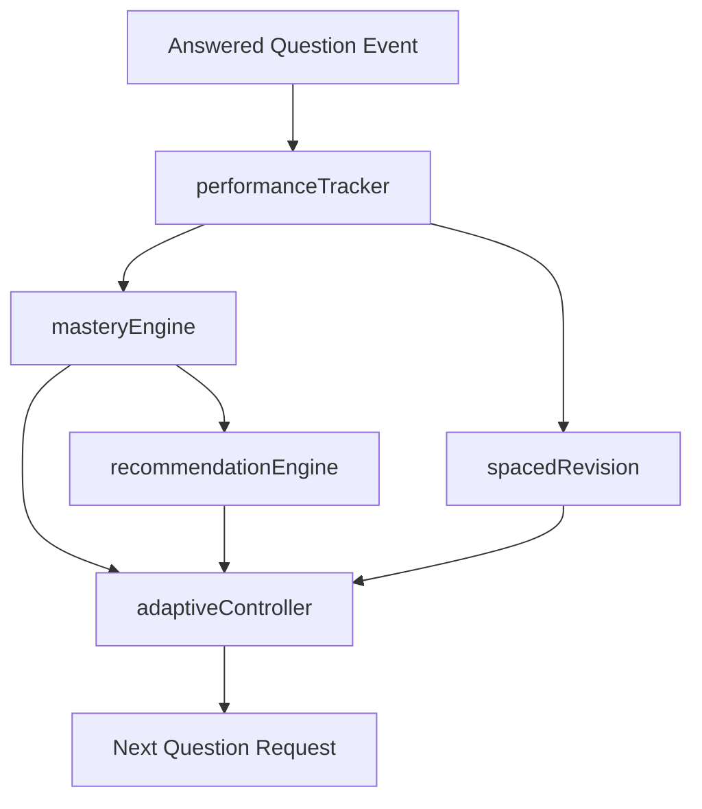

# Jannati AI Tutor v3 Sprint 3 - Adaptive Learning Engine v1

## Architecture

The adaptive engine is a modular recommendation layer that sits beside the existing question bank, scoring, and AI Coach systems.

Modules:

- `performanceTracker.js`
  - records answered question events
  - stores subject, topic, correctness, time taken, hint/explain usage, and timestamp
- `masteryEngine.js`
  - calculates mastery scores from topic performance data
- `recommendationEngine.js`
  - turns mastery into learning actions: review, normal practice, or advance
- `spacedRevision.js`
  - converts performance history into review timing and priority
- `adaptiveController.js`
  - coordinates performance, mastery, recommendation, spaced revision, and next-question selection
- `index.js`
  - exports the adaptive v1 API surface

## Data Flow

Flow:

1. A student answers a question.
2. `performanceTracker` records the event on the student profile.
3. `masteryEngine` computes a 0–100 mastery score for the topic.
4. `recommendationEngine` maps mastery to a learning action.
5. `spacedRevision` calculates when the topic should be reviewed again.
6. `adaptiveController` combines the signals and chooses the next best question or recommendation.

## Mastery Algorithm

The first adaptive version uses a weighted topic score derived from:

- accuracy
- total attempts
- wrong answers
- average response time
- XP contribution
- recency of practice
- difficulty weighting

The score stays in the range `0–100`.

Interpretation:

- `0–59` → weak / review
- `60–85` → stable / normal practice
- `86–100` → strong / advance

## Recommendation Rules

`recommendationEngine` maps mastery into one of three learning actions:

- `< 60` → `review`
- `60–85` → `normal practice`
- `> 85` → `increase difficulty or move to next topic`

The controller also considers:

- prior mistakes
- hint and explanation usage
- session balance
- spaced revision priority

## Spaced Revision Strategy

The revision scheduler uses a simple interval ladder:

- 1 day
- 3 days
- 7 days
- 14 days
- 30 days

Topics with lower mastery or more errors are scheduled sooner.
High-mastery topics stay in the queue at longer intervals so they can still be revisited.

## Debug Mode

Development-only debug output can be enabled with:

- `ADAPTIVE_DEBUG=1`

Debug output includes:

- mastery
- recommendation
- review priority

No production logging is emitted.

## Future Analytics Integration

This architecture is ready for future analytics enhancements such as:

- time-based trend analysis
- cross-subject study balance
- parent dashboard insights
- topic-to-topic transition analysis
- smarter spaced revision windows

The current design keeps the engine modular so these upgrades can be added without changing the UI or question bank.
