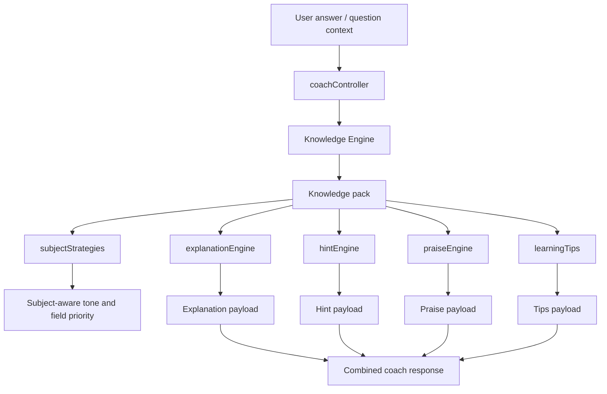

# V3 AI Coach Architecture

## Overview

AI Coach 2.0 introduces a modular, subject-aware coaching layer that sits on top of the existing Knowledge Engine. It does not change the question bank, adaptive engine, scoring, or existing UI behavior.

The architecture separates coaching into focused modules so each part can evolve independently:

- `explanationEngine`
- `hintEngine`
- `praiseEngine`
- `learningTips`
- `subjectStrategies`
- `coachController`

---

## Module Responsibility

### `subjectStrategies`

Defines subject-aware tone, fallback language, and field preferences for each supported subject.

Supported subjects:

- Mathematics
- Bahasa Melayu
- English
- Science
- Pendidikan Islam
- Bahasa Arab
- PJK

### `explanationEngine`

Builds the main explanation payload using subject strategy and Knowledge Engine content. It prioritizes teacher explanations, then simple explanations, then a safe subject-specific fallback.

### `hintEngine`

Generates hints from the most useful knowledge fields for the subject. It keeps hints short, clear, and age-appropriate.

### `praiseEngine`

Generates praise and encouragement messages based on result state and subject tone.

### `learningTips`

Extracts topic tips, memory tips, and common mistakes into a compact guidance payload.

### `coachController`

Orchestrates the full coaching response:

1. Load subject/topic knowledge
2. Select subject strategy
3. Build explanation
4. Build hint
5. Build praise
6. Build learning tips

---

## Data Flow

### Flow notes

- The Knowledge Engine remains the source of subject/topic content.
- The new v3 coach layer only shapes that content into subject-aware coaching output.
- If a knowledge pack is unavailable, the controller still falls back to safe subject strategy text.

---

## Future Extension Plan

The architecture is ready for gradual growth without refactoring the core flow.

Planned extension points:

- subject-specific coaching templates
- stronger topic classification for hints and examples
- richer follow-up question selection
- mastery-aware praise rotation
- localized coaching styles for advanced topics
- analytics hooks for which coaching response performs best

Future work should continue to:

- keep modules small and testable
- avoid hardcoded UI strings
- preserve Knowledge Engine compatibility
- leave scoring and adaptive logic untouched

