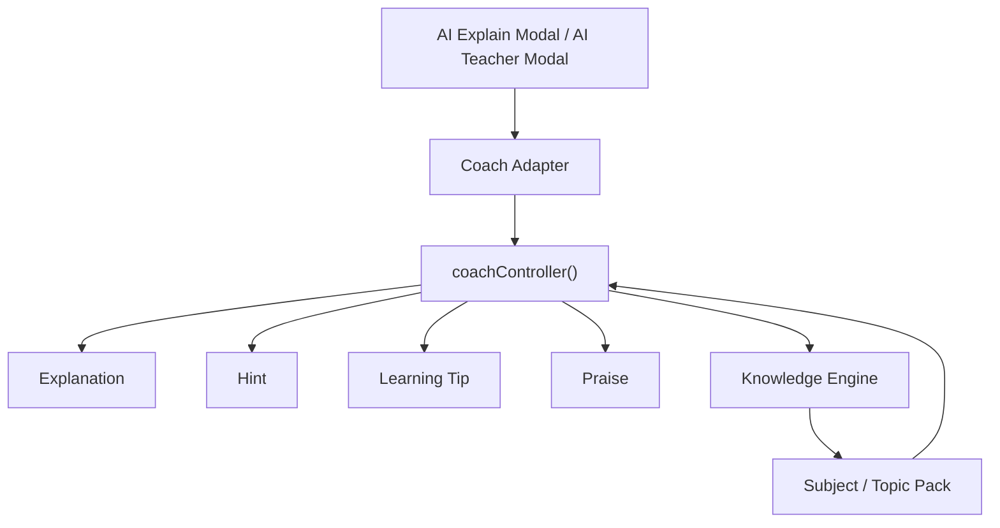

# V3 AI Coach Integration

## Integration Diagram

## Adapter Responsibilities

The adapter layer acts as the bridge between the existing UI and the new v3 coach architecture.

It is responsible for:

- accepting the current modal context
- calling `coachController()`
- normalising the returned data shape for the existing modals
- falling back to the legacy explanation and teaching engines when knowledge data is incomplete
- logging lightweight development-only diagnostics

### Development logging

Logged in development only:

- subject
- topic
- response time
- whether a fallback was used

Production builds remain quiet.

---

## Fallback Flow

If the knowledge response is incomplete or unavailable:

1. The adapter keeps the existing modal open.
2. It fills any missing fields from the current fallback engines.
3. It preserves the old user workflow.
4. It avoids blank or broken teaching content.

Fallback priorities:

1. Coach v3 data
2. Knowledge Engine fallback
3. Legacy explanation / teaching engine

This ensures that users still receive:

- hint
- learning tip
- praise

even if one layer returns incomplete content.

---

## Future API Integration Path

The current adapter is intentionally thin so that a future API-backed coach service can be introduced without changing the UI.

Future directions:

- replace local coachController calls with remote API calls
- keep the adapter interface unchanged
- preserve the same modal data contract
- support caching for repeated modal opens
- add analytics for coach response quality

This keeps the application ready for a future networked coach layer while protecting the current workflow.

