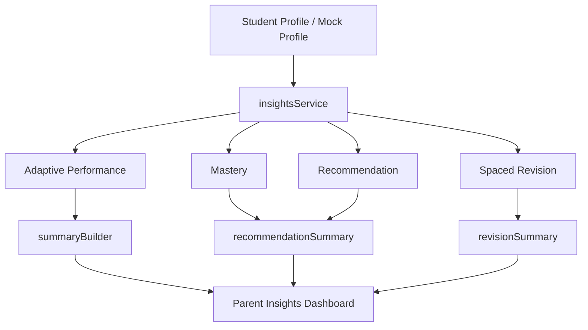

# Jannati AI Tutor v3 Sprint 4 - Parent Insights Dashboard (MVP)

## Architecture

The Parent Insights layer is a read-only analytics wrapper over the adaptive engine.

Modules:

- `insightsService.js`
  - reads adaptive performance, mastery, recommendation, and revision data
  - provides a mock profile fallback when the real profile is too sparse
- `summaryBuilder.js`
  - builds parent-facing totals such as questions answered, accuracy, study time, and streak
- `recommendationSummary.js`
  - summarizes strongest subjects, weakest subjects, focus topics, and AI recommendations
- `revisionSummary.js`
  - summarizes upcoming review schedule, overdue reviews, and review priorities
- `index.js`
  - exports the Parent Insights API surface

## Data Flow

## Mapping from the Adaptive Engine

Parent Insights reuses the existing adaptive layer without duplicating business rules:

- `performanceTracker`
  - read for answered questions, timestamps, and usage signals
- `masteryEngine`
  - read for topic mastery and performance interpretation
- `recommendationEngine`
  - read for review / practice / advance guidance
- `spacedRevision`
  - read for review scheduling and due topics

The dashboard itself stays read-only and only formats this data for parent consumption.

## Mock Profile Strategy

If a real profile has insufficient history, the service returns a safe mock profile with zeroed totals.

This avoids blank dashboard states while keeping the layer read-only.

## Future Analytics Roadmap

Future enhancements can extend this MVP with:

- subject-level trend charts
- weekly progress deltas
- study habit analysis
- parent-friendly intervention suggestions
- cross-subject balance indicators
- notifications for overdue revision

The current design keeps all analytics separate from UI and scoring logic so it can grow safely.
