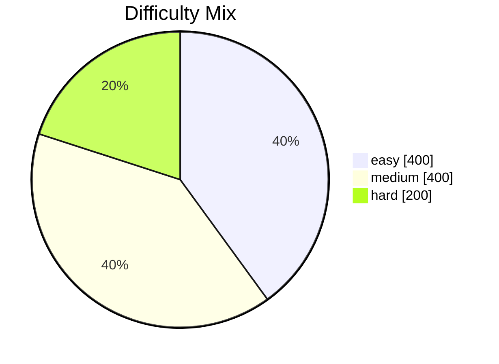

# Curriculum Intelligence Audit Report

Date: 2026-07-07T11:00:51.649Z

## Run Summary

- Target accepted questions: 1000
- Accepted questions: 1000
- Total generated samples observed: 1020
- Batch attempts: 34
- Similarity guard rejections: 0
- Semantic guard rejections: 0

## Verification Checks

- Objective cap (<=20% above average): PASS (max 50, avg 50.00)
- Context cap (<=25% above average): FAIL (max 556, avg 250.00)
- Difficulty distribution compliance: PASS (delta easy 0.00%, medium 5.00%, hard 5.00%)
- Duplicate stems remain 0: PASS (0)
- Semantic duplicate rate below 1%: PASS (0.00%)

## Learning Objective Distribution

| Learning Objective | Count | % | Chart |
|---|---:|---:|---|
| OBJ_BM_KATA_NAMA_AM (bm_kata_nama_am) | 50 | 5.00% | █░░░░░░░░░░░░░░░░░░░░░░░ |
| OBJ_BM_KATA_NAMA_KHAS (bm_kata_nama_khas) | 50 | 5.00% | █░░░░░░░░░░░░░░░░░░░░░░░ |
| OBJ_BM_KATA_GANTI_NAMA (bm_kata_ganti_nama) | 50 | 5.00% | █░░░░░░░░░░░░░░░░░░░░░░░ |
| OBJ_BM_KATA_KERJA (bm_kata_kerja) | 50 | 5.00% | █░░░░░░░░░░░░░░░░░░░░░░░ |
| OBJ_BM_KATA_ADJEKTIF (bm_kata_adjektif) | 50 | 5.00% | █░░░░░░░░░░░░░░░░░░░░░░░ |
| OBJ_BM_KATA_SENDI (bm_kata_sendi) | 50 | 5.00% | █░░░░░░░░░░░░░░░░░░░░░░░ |
| OBJ_BM_KATA_HUBUNG (bm_kata_hubung) | 50 | 5.00% | █░░░░░░░░░░░░░░░░░░░░░░░ |
| OBJ_BM_PENJODOH_BILANGAN (bm_penjodoh_bilangan) | 50 | 5.00% | █░░░░░░░░░░░░░░░░░░░░░░░ |
| OBJ_BM_AYAT (bm_ayat) | 50 | 5.00% | █░░░░░░░░░░░░░░░░░░░░░░░ |
| OBJ_BM_PEMAHAMAN_PENULISAN (bm_pemahaman_penulisan) | 50 | 5.00% | █░░░░░░░░░░░░░░░░░░░░░░░ |
| NUM_001 (number_sense_under_1000) | 50 | 5.00% | █░░░░░░░░░░░░░░░░░░░░░░░ |
| ADD_001 (basic_addition_under_20) | 50 | 5.00% | █░░░░░░░░░░░░░░░░░░░░░░░ |
| SUB_001 (basic_subtraction_under_20) | 50 | 5.00% | █░░░░░░░░░░░░░░░░░░░░░░░ |
| MUL_001 (basic_multiplication_facts) | 50 | 5.00% | █░░░░░░░░░░░░░░░░░░░░░░░ |
| DIV_001 (basic_division_facts) | 50 | 5.00% | █░░░░░░░░░░░░░░░░░░░░░░░ |
| MON_001 (money_and_value_basics) | 50 | 5.00% | █░░░░░░░░░░░░░░░░░░░░░░░ |
| TIM_001 (time_and_schedule_basics) | 50 | 5.00% | █░░░░░░░░░░░░░░░░░░░░░░░ |
| OBJ_MATH_PANJANG (math_panjang) | 50 | 5.00% | █░░░░░░░░░░░░░░░░░░░░░░░ |
| OBJ_MATH_JISIM_ISI_PADU (math_jisim_isi_padu) | 50 | 5.00% | █░░░░░░░░░░░░░░░░░░░░░░░ |
| GEO_001 (shape_and_space_basics) | 50 | 5.00% | █░░░░░░░░░░░░░░░░░░░░░░░ |

## Difficulty Distribution

| Difficulty | Count | % | Chart |
|---|---:|---:|---|
| easy | 400 | 40.00% | ██████████░░░░░░░░░░░░░░ |
| medium | 400 | 40.00% | ██████████░░░░░░░░░░░░░░ |
| hard | 200 | 20.00% | █████░░░░░░░░░░░░░░░░░░░ |

## Stem Template Usage (Top 20)

| Stem Template / Pattern | Count | % | Chart |
|---|---:|---:|---|
| Apakah kata nama am dalam ayat ini? Siti membaca buku di ruang tamu. | 1 | 0.10% | ░░░░░░░░░░░░░░░░░░░░░░░░ |
| Apakah kata nama am dalam ayat ini? Ayah membeli ikan di pasar. | 1 | 0.10% | ░░░░░░░░░░░░░░░░░░░░░░░░ |
| Apakah kata nama am dalam ayat ini? Murid beratur di kantin. | 1 | 0.10% | ░░░░░░░░░░░░░░░░░░░░░░░░ |
| Apakah kata nama am dalam ayat ini? Guru menulis di papan putih. | 1 | 0.10% | ░░░░░░░░░░░░░░░░░░░░░░░░ |
| Apakah kata nama am dalam ayat ini? Kucing itu tidur di bawah meja. | 1 | 0.10% | ░░░░░░░░░░░░░░░░░░░░░░░░ |
| Apakah kata nama am dalam ayat ini? Adik menyimpan kasut di rak. | 1 | 0.10% | ░░░░░░░░░░░░░░░░░░░░░░░░ |
| Apakah kata nama am dalam ayat ini? Kami bermain di taman. | 1 | 0.10% | ░░░░░░░░░░░░░░░░░░░░░░░░ |
| Apakah kata nama am dalam ayat ini? Doktor memeriksa pesakit itu. | 1 | 0.10% | ░░░░░░░░░░░░░░░░░░░░░░░░ |
| Apakah kata nama am dalam ayat ini? Burung hinggap di dahan. | 1 | 0.10% | ░░░░░░░░░░░░░░░░░░░░░░░░ |
| Apakah kata nama am dalam ayat ini? Emak menyapu lantai. | 1 | 0.10% | ░░░░░░░░░░░░░░░░░░░░░░░░ |
| Dalam ayat "Siti membaca buku di ruang tamu.", apakah kata nama am? | 1 | 0.10% | ░░░░░░░░░░░░░░░░░░░░░░░░ |
| Dalam ayat "Ayah membeli ikan di pasar.", apakah kata nama am? | 1 | 0.10% | ░░░░░░░░░░░░░░░░░░░░░░░░ |
| Dalam ayat "Murid beratur di kantin.", apakah kata nama am? | 1 | 0.10% | ░░░░░░░░░░░░░░░░░░░░░░░░ |
| Dalam ayat "Guru menulis di papan putih.", apakah kata nama am? | 1 | 0.10% | ░░░░░░░░░░░░░░░░░░░░░░░░ |
| Dalam ayat "Kucing itu tidur di bawah meja.", apakah kata nama am? | 1 | 0.10% | ░░░░░░░░░░░░░░░░░░░░░░░░ |
| Dalam ayat "Adik menyimpan kasut di rak.", apakah kata nama am? | 1 | 0.10% | ░░░░░░░░░░░░░░░░░░░░░░░░ |
| Dalam ayat "Kami bermain di taman.", apakah kata nama am? | 1 | 0.10% | ░░░░░░░░░░░░░░░░░░░░░░░░ |
| Dalam ayat "Doktor memeriksa pesakit itu.", apakah kata nama am? | 1 | 0.10% | ░░░░░░░░░░░░░░░░░░░░░░░░ |
| Dalam ayat "Burung hinggap di dahan.", apakah kata nama am? | 1 | 0.10% | ░░░░░░░░░░░░░░░░░░░░░░░░ |
| Dalam ayat "Emak menyapu lantai.", apakah kata nama am? | 1 | 0.10% | ░░░░░░░░░░░░░░░░░░░░░░░░ |

## Context Template Usage

| Context Type | Count | % | Chart |
|---|---:|---:|---|
| story | 556 | 55.60% | █████████████░░░░░░░░░░░ |
| classroom | 341 | 34.10% | ████████░░░░░░░░░░░░░░░░ |
| object | 61 | 6.10% | █░░░░░░░░░░░░░░░░░░░░░░░ |
| real-life | 42 | 4.20% | █░░░░░░░░░░░░░░░░░░░░░░░ |

## Duplicate and Guard Metrics

- Duplicate stems: 0
- Semantic duplicate count: 0
- Semantic duplicate rate: 0.00%
- Semantic guard rejections: 0
- Similarity guard rejections: 0

## Distribution Summary

- Learning objectives covered: 20
- Difficulty mix (easy/medium/hard): 400/400/200
- Context types covered: 4
- Accepted uniqueness guarantee: Exact stem uniqueness preserved

## Recommendations

- Add stronger context-type penalties for recently used context clusters.
- Current guard rejection pressure: semantic 0, similarity 0.
